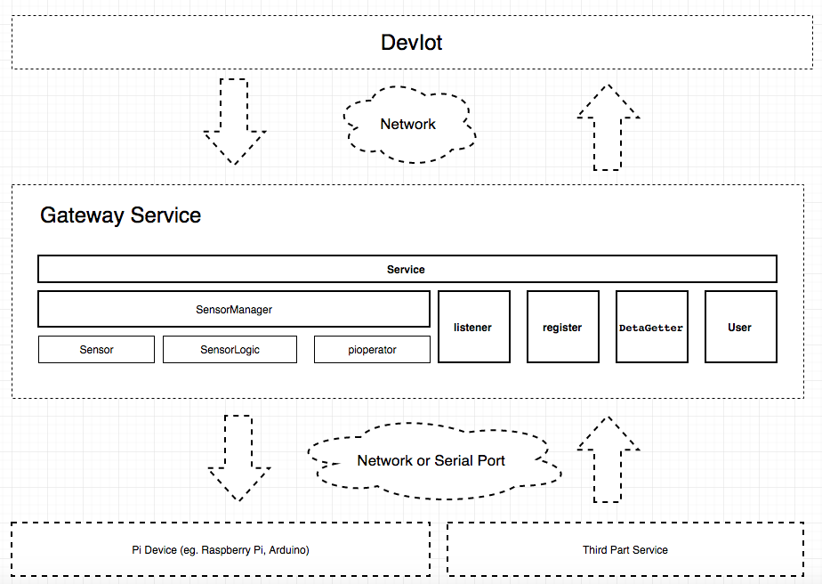

# Starter Kit of Gateway Service for the Cisco Development Platform Internet of Things (IoT)

A Starter Kit for building the gateway service to work with the [Cisco DevIoT](http://developer.cisco.com/site/devnetlabs/deviot/)

The document and the code samples will provide a complete end to end example of how to use this SDK to build a gateway service to work with [Cisco DevIoT](http://developer.cisco.com/site/devnetlabs/deviot/).

DevIoT is an Internet of things development environment enabling frictionless design and
 deployment of complex IoT solutions.[more detail](http://developer.cisco.com/site/devnetlabs/deviot/)

This SDK will help DevIot get the data quick from devices(real sensor with Pi), third-part service(CMX) and so on.

This SDK support both two way to communicate with DevIot server, http and MQ protocol.

## Table of contents

* [What in this code](#what-in-this-code)
* [Prerequisite](#prerequisite)
* [How to use](#how-to-use)
* [SDK API](#sdk-api)
* [Programing with Sdk](#programing-with-sdk)
* [Samples](#samples)
* [Getting help](#getting-help)

## What in this code
1.gateway folder: the sdk core

2.samples folder: use the gateway sdk to build three gateway service to work with DevIot. if you want to build your own gateway service, you can refer to those three samples

##Prerequisite
1.[Python2.7](https://www.python.org/downloads/):This sdk base on the Python 2.7.10

2.[Flask](http://flask.pocoo.org/):This sdk use this to build a simple http server

3.[paho-mqtt](https://eclipse.org/paho/clients/python/): this sdk use this to build a simple MQTT client

you can use pip install flask and  paho-mqtt by follow command:
    
        sudo pip install flask
        sudo pip install paho-mqtt

##How to use
1.Put the gateway folder under root folder of your gateway project

2.Use Sensor class to define your sensors, please check the SDK API section to get more info about Sensor class. 

[more sample](https://cto-github.cisco.com/tingxxu/iot-gateway/tree/master/samples/raspberry-pi/sensors)

3.Configuration

Add a file named "setting.cfg" under the root folder, put all your settings segment in this file, please put those settings with JSON format.

setting.cfg file:

    {
        "address":"10.140.92.25:9000",              #necessary,it is DevIot platform server address
        "mqtthost":"mqtt.cisco.com",                #necessary,it is the DevIot platform MQTT server address
        "mqttport":7777,                            #necessary,it is the DevIot platform MQTT server port number
        "sensors": {                                #necessary,you need register you sensor information in here, if you don't have any sensor, keep it empty
                                                    
        },
        
        other setting ....
        
        
    }
    
In settings.cfg file, you need add "sensors" segment to define all the sensors you want to used in your gateway service, each sensor segment should be follow format:
    
    sensor_id:{                                     #necessary, sensor id is the identify id for the sensor, the best way to named a sensor is kind_fix, e.g. temperature_r
        "name":"sensor name",                       #necessary, name is display name of sensor in DevIot platform
        "kind":"sensor kind",                       #necessary, kind is the a type identifier of sensor
        "other information":"info",                 #unnecessary, it depend on your gateway service
        ...
    }
    
sample:
    
    "sensors": {
        "temperature_r":
        {
            "name":"RTemperature",
            "kind":"temperature",
            "pin": 0,
            "type": "data"
        },
        "sound_r":
        {
            "name":"RSound",
            "kind":"sound",
            "pin": 1,
            "type": "data"
        }
    }

[more sample](https://cto-github.cisco.com/tingxxu/iot-gateway/blob/master/samples/cmx/setting.cfg)
    
    
so you can use config object to read setting in python code

      from gateway.config import config
      devIot_address = config["address"]
      
4.Crate a python file under the root folder and add type follow code:
    
    from gateway.service import Service
    from gateway.config import config

    if __name__ == '__main__':

        devIot_address = config["address"]                  # get the DevIot platform address
        
        app = Service("raspberry", devIot_address, False)   # create an instance of Service class
    
        app.mqtt_server = config["mqtthost"]                # if you want to use MQTT protocol, please set the mqtt_server address and port to app
        app.mqtt_port = config["mqttport"]
          
        app.run()                                           # Call the run method to start the gateway service

    
When you call run method, gateway will do follow things step by step:
    
* Load custom sensor logic
* Read register sensors information from settings.cfg file
* Register sensor info to DevIot platform
* Start a MQTT pip or a Http server to communicate with DevIot platform
* Post sensor data to DevIot platform
* Listen to commands come from DevIot platform
     

## SDK API
###Service
Service class is used to build a new gateway app

####Constructor Parameters
* app_name : the gateway service name, DevIot platform will use this name to identify the source of sensors
* iot_address : the gateway api of DevIot platform

####Properties
* app_name      : the gateway service name, DevIot platform will use this name to identify the source of sensors
* iot_address   : the gateway api of DevIot platform

####Methods
* run: start the gateway app process, it will import all the sensors in the sensors folder, register sensors to DevIot platform and start a http server to listen the http request
* get_data_getter: this method will supply a default data getter to service, you don't need call this method directly, in most time you need use a sub-class to inherit service class to override this method to supply you own data getter

####Sample

    from gateway.service import Service
    from gateway.config import config
    from logic.cmxgetter import CmxGetter
    
    
    class App(Service):
    
        def get_data_getter(self, ip, port, manager):
            getter = CmxGetter(manager, ip, port)
            return getter
    
    
    if __name__ == '__main__':
    
        devIot_address = config["address"]
        app = App("cmx", devIot_address, True)
        app.run()
        
[more samples](https://cto-github.cisco.com/tingxxu/iot-gateway/blob/master/samples/cmx/app.py)

###Sensor###
Sensor class used to be expressed a new sensor

####Constructor Parameters
* sensor_kind : the kind of sensor, describe the function of sensor
* sensor_id : the key of sensor
* sensor_name : the sensor name or caption
####Properties
* name : the sensor name or caption
* kind : the kind of sensor, describe the function of sensor
* id   : the key of sensor

####Methods
* add_property : add a new sensor property, the parameter should be type of SProperty
* add_action   : add a new sensor action, the parameter should be type of SAction
* add_setting   :add a new sensor setting, the parameter should be type of SSetting

    light = Sensor("light", "light.1", "Light")
    
    value_property = SProperty("value", 0, [0, 100], 0)
    
    light.add_property(value_property)

[more samples](https://cto-github.cisco.com/tingxxu/iot-gateway/tree/master/samples/raspberry-pi/sensors)

In order to let the App know your sensors, you can create a folder named "sensors" under the root folder of your project. then the App class will import all the sensors in the "sensors" folder 
[sample](https://cto-github.cisco.com/tingxxu/iot-gateway/tree/master/samples/raspberry-pi)

####Methods
* run : you need create your own DataGetter and override this method to supply the logic about how to get the data
    
[more samples](https://cto-github.cisco.com/tingxxu/iot-gateway/blob/master/samples/cmx/logic/cmxgetter.py)

###PiOperator
PiOperator is an abstract, static class for define the interface how to get the data from real device, it include read and write method, you need inherit this class 
and put the logic about how to read data and write data to device in those two methods.
    
    class GrovePiOperator(PiOperator):

        @staticmethod
        def write(pin, data):
            if is_debug is False:
                from grovepi import grovepi
                grovepi.pinMode(pin, output_fix)
                grovepi.digitalWrite(pin, data)
            else:
                print("write data..." + str(data))
    
        @staticmethod
        def read(pin):
            if is_debug is False:
                from grovepi import grovepi
                data = grovepi.analogRead(pin)
                return data
            else:
                return random.randint(0, 100)
                
[the whole sample](https://cto-github.cisco.com/tingxxu/iot-gateway/blob/master/samples/raspberry-pi/logic/grovepioperator.py)

###SensorLogic
SensorLogic is an abstract, static class used to update the sensor with data from data getter or activate the sensor action. you also can translate the raw data to real data in here. eg. 
    
    class TemperatureLogic(SensorLogic):
        pin = config["sensors"]['temperature']['pin']
    
        @staticmethod
        def update(sensor, data):
            raw_value = GrovePiOperator.read(TemperatureLogic.pin)
            new_value = 0
            if raw_value != 0:
                b_key = 4250
                resistance = (1023 - raw_value) * 10000.0 / raw_value
                new_value = 1/(math.log(resistance/10000)/b_key+1/298.15)-273.15
            updated_properties = {"value": new_value}
            SensorLogic.update_properties(sensor, updated_properties)

[more sample](https://cto-github.cisco.com/tingxxu/iot-gateway/blob/master/samples/raspberry-pi/sensors/buzzer.py)

##Programing with Sdk##
The follow steps will help you know how to use this SDK to build a DevIoT Gateway on Pi:

1.Use follow command to install this SDK:
    
        sudo pip install DevIoT_Pi_SDK

2.Register sensors in setting.cfg file:Create a new file named setting.cfg in your workspace folder, then you can follow the relation between sensor and GrovePi port, code the setting item like this:
     
     "button_r":                                 #necessary, sensor id is the identify id for the sensor, we suggest that you named a sensor as this format: kind_fix
         {
             "name":"RButton",                   #necessary, name is display name of sensor in DevIot platform
             "kind":"button",                    #necessary, kind is the a type identifier of sensor
             "pin": 0,                           #necessary, connect to the A0 port
             "type": "data"                      #necessary, it means A0 is readable
         }
it means the button sensor connect to the O port and the pin is readable(AO port)

we can also set the DevIot platform address in this file. it is better to organize those settings with JSON format. 

when we finished those setting, the setting.cfg file should be like this:
    
    {
    "address":"10.140.92.25:9000",
    "mqtthost":"mqtt.cisco.com",
    "mqttport":7777,
    "sensors": {
        "button_r":
        {
            "name":"RButton",
            "kind":"button",
            "pin": 0,
            "type": "data"
        },
        "sound_r":
        {
            "name":"RSound",
            "kind":"sound",
            "pin": 1,
            "type": "data"
        },
        "light_r":
        {
            "name":"RLight",
            "kind":"light",
            "pin": 2,
            "type": "data"
        },
        "led_r":
        {
            "name":"RLed",
            "kind":"led",
            "pin": 3,
            "type": "action"
        },
        "buzzer_r":
        {
            "name":"RBuzzer",
            "kind":"buzzer",
            "pin": 4,
            "type": "action"
        }
    }
}

3.Create app entry: create a new python file as the app entry in your workspace, i named this file as "app.py". in this file, then follow those steps:
* Use config object to get the DevIoT address, mqtt server address, app name, DevIot account information from setting.cfg file.
* Instance a new PiGateway, and pass though those required parameters.
* Set the default sensor logic handle (see the segment of SensorLogic)
* Call run method of PiGateway instance

Here is the code:
    
    from DevIoTGatewayPi.pigateway import PiGateway
    from DevIoTGatewayPi.config import config
    from logic.defaultsensorlogic import DefaultSensorLogic

    if __name__ == '__main__':
    
        devIot_address = config.get_string("address", "10.140.92.25:9000")
        mqtt_address = config.get_string("mqtthost", "10.140.92.25:1883")
        app_name = config.get_string("appname", "raspberry")
        devIot_account = config.get_info("account", "")
    
        app = PiGateway(app_name, devIot_address, mqtt_address, devIot_account)
        app.default_sensor_logic = DefaultSensorLogic
        app.run()

4.Operate the GrovePi. Add a new folder named "logic"(whatever you like), add a new python file named as "grovepioperator" under this folder, then follow those steps:
* Create a sub class inherit the PiOperator class 
* Implement the write and read method. you should check the GrovePi SDK to learn how to read or write the data from the GrovePi. you can also use follow code directly

I add is_debug variable to let this app can run without the GrovePI device, if the is_debug is True, the read method just return some random data and the write method just put out some log
    
    from DevIoTGatewayPi.pioperator import PiOperator

    import os
    import random
    
    analog = 'analog'
    digital = 'digital'
    input_fix = 'INPUT'
    output_fix = 'OUTPUT'
    
    is_debug = False
    if "DEBUG" in os.environ:
        is_debug = os.environ['DEBUG'] == 'TRUE'

    class GrovePiOperator(PiOperator):
    
        @staticmethod
        def write(pin, data):
            if is_debug is False:
                from grovepi import grovepi
                grovepi.pinMode(pin, output_fix)
                grovepi.digitalWrite(pin, data)
            else:
                print("write data..." + str(data))
    
        @staticmethod
        def read(pin):
            if is_debug is False:
                from grovepi import grovepi
                data = grovepi.analogRead(pin)
                return data
            else:
                return random.randint(0, 100)
                

5.Add sensor model and logic. 

create a new folder and which should be named "sensors".

after above steps, your workspace should like this:

in the sensor folder, create a new python file named "temperature",add the follow code to this file:
    
    from DevIoTGateway.sensor import *
    from DevIoTGatewayPi.config import config
    from DevIoTGatewayPi.sensorlogic import SensorLogic
    from logic.grovepioperator import GrovePiOperator
    
    
    thermometer = Sensor('thermometer', 'thermometer_1', 'RThermometer')
    
    temperature_property = SProperty('temperature', 0, [0, 100], 0)
    humidity_property = SProperty('humidity', 0, [0, 100], 0)
    
    thermometer.add_property(temperature_property)
    thermometer.add_property(humidity_property)
    
    class ThermometerLogic(SensorLogic):
    
        @staticmethod
        def update(sensor, data):
            pin = config['sensors'][sensor.id]['pin']
            new_temp, new_hum = GrovePiOperator.read(pin, mode='dht')
            updated_properties = {'temperature': new_temp, 'humidity': new_hum}
            SensorLogic.update_properties(sensor, updated_properties)

            
In above code:

* we use Sensor class to create a sound sensor model, and define a value with SProperty class. 

* we create a static class named "SoundLogic" which inherit from SensorLogic and override the update method, in this method we use the GrovePiOperator to read the data from the real sound sensor.

you need get more detail from GrovePi sdk to know how to covert the raw sensor data to real data.

you can repeat above step to create other sensors

6.Add the __init__.py file in logic and sensor folder to make other file can refer to the code in those two folder.

Now you can use follow command to test your Gateway service:

    sudo python app.py
    
    
##Samples##
* [DevIoT Raspberry Gateway Service](https://github.com/tingxin/DevIoT_RaspberryPi_Starter_Kit)
* [DevIoT Arduino Gateway Service](https://github.com/tingxin/DevIoT_Arduino_Starter_Kit)

## Getting help

If you have questions, concerns, bug reports, etc, please file an issue in this repository's Issue Tracker

## Getting involved

For general instructions on _how_ to contribute, please visit [CONTRIBUTING](CONTRIBUTING.md)

## Open source licensing info

1. [LICENSE](LICENSE)

## Credits and references

None